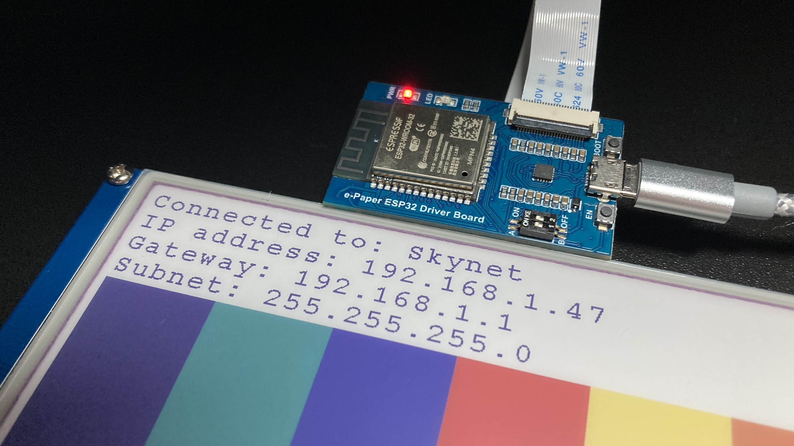
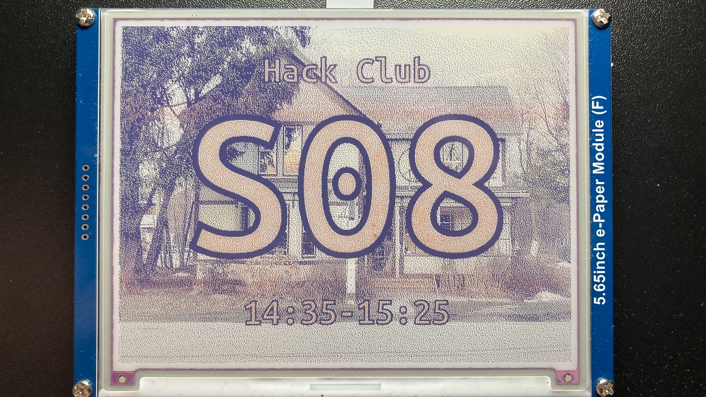

# wifi-doorsign
[](https://xcfile.dev)

A WiFi-connected ePaper display used as a fancy door sign.



## Why?

The current door signs in my school are small boring stickers that don't really allow for any creativity, or useful information aside from the room number/code. 

I was challenged to create a fun door sign for the Computer Science department rooms that can display a seasonal picture background, along with the room code and additional information. I was allowed to borrow a 7-color ePaper display and controller to develop with over the Christmas holidays for fun.

## Design considerations

### Readable clearly, quickly, and from a distance

I used contrasting colors for the text fill and text outline, along with a very large font to ensure it can be read from a distance, and monospaced to ensure it will fit on the screen.

### Easy to use, with an intuitive interface

I decided to use a webpage to make it incredibly easy to update the display, and to allow for a preview of the display before it is updated. It offloads the image processing to the web client, meaning much faster update times, realtime change preview, and support of more image formats. The option is also provided to set a background color, meaning an image is not required if the user prefers a solid color - or to fill in the background of a transparent image.

The web interface also uses [the color-palette defined by the web client viewing it](https://developer.mozilla.org/en-US/docs/Web/CSS/system-color), so it can be viewed in light mode, dark mode, or with high contrast, if the user prefers.

Finally, the interface provides an 'identify' button that writes out the IP of the screen to the display, so it can be easily seen when multiple screens are connected to the same network.

### Quick to set-up

The device prints its IP address to the screen when it is first booted up, so it is easy to connect to.

### Maintainable

I chose PlatformIO as the build system as it is much quicker and easier to use than the Arduino IDE, which requires a GUI and lots of setup-time, and makes it easier to add new libraries and boards.

### Secure

The WiFi credentials are hardcoded into the firmware, so access to update the screen's contents is restricted to those who have physical access to the device's USB port, or have the credentials to connect to the same WiFi network that the screen is connected to. Finally, a username/password combo is required to access the web interface, so only those who know the credentials can update the screen.

## How?

I took the [(very poorly-written) example from WaveShare's website](https://files.waveshare.com/upload/5/50/E-Paper_ESP32_Driver_Board_Code.7z) and rewrote the required libraries to understand how the display is controlled, and to make development easier by removing duplicate functionality and clarifying the purpose of ambiguously-named functions.

I also ported the library and example code over from using the Arduino IDE to using PlatformIO, making the build+upload process significantly easier as PlatformIO supports automatically downloading all boards+libraries in one command by reading the platformio.ini file, instead of having to navigate a GUI and copy/paste board and library URLs if using a new machine, making it more maintainable.

https://github.com/user-attachments/assets/719105b5-a09b-4d02-a22d-3bb571632b7c



Wifi credentials are stored under `include/secrets.h` which is gitignore'd, see [`include/secrets_example.h`](include/secrets_example.h) for an example.

## Tasks

### Upload

Upload the firmware to the ESP32 board.

```bash
pio run -e esp32dev --target upload
```

### Monitor

Monitor the serial output of the ESP32 board.

```bash
pio device monitor
```

